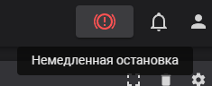

# Таймер

## Описание
Это таймер для отложенной 3д печати. Код, представленный в данном репозитории, создавался изначально для Creality K1 / K1 Max / K1C, но возможно подойдет и для других принтеров на Klipper, если внести некоторые изменения
### Для чего он нужен?
В качестве основного сценария использования рассматривалась печать ночью[^1]. Хотелось, чтобы принтер, когда я заснул, сам включался и начинал печатать

Думаю, таймер многим пригодится, особенно при длительной печати. Особенно тем, у кого принтер стоит в той же комнате, и кто не хочет днем слышать шум. С помощью таймера можно увеличить производительность вашего принтера, ведь ночь занимает немалую часть суток, которую лучше использовать с пользой
### Резюме
Данный таймер был сделан в первую очередь для себя, поэтому все в нем реализовано именно так, как мне удобно 

Основные отличия от [уже существующего решения](https://github.com/Tombraider2006/K1/blob/main/timer.md):
* Возможность задавать время в часах и минутах, а не только в минутах. Согласитесь, неудобно каждый раз переводить часы в минуты
* Таймер можно ставить как на промежуток (через X времени включится), так и на определенное время (во время X включится). Хорошо тем, что не надо высчитывать, сколько же времени осталось до определенного момента
* В нем нет "ползунка", так как на мой взгляд ~~это свистоперделка~~ удобнее задавать время числами, и по сути это лишний компонент
* Было удалено мигание, чтобы не так цепляло глаз и не мешало засыпать. Я и так знаю (а плюсом в консоль все выводится), когда поставил таймер, поэтому мне не нужна индикация. Если вам нужно, можете добавить его
* Яркость подсветки при печати стало можно выбирать
## Инструкция

### Установка
1. Откройте *ssh терминал* принтера в Putty или другом клиенте
2. Отправьте следующие команды:

```
cd /usr/data/printer_data/config
mkdir Timer-Script
cd Timer-Script
wget --no-check-certificate https://raw.githubusercontent.com/qocaier/Timer/main/Timer-Script/timer.cfg
wget --no-check-certificate https://raw.githubusercontent.com/qocaier/Timer/main/Timer-Script/now.cfg
```

3. Откройте *файлы конфигурации* принтера во Fluidd или другом веб-интерфейсе
4. Среди них есть *printer.cfg*, откройте его и добавьте следующие строки: в начало - `[include Timer-Script/timer.cfg]`, в конец - `[respond]`
5. Сохраните файл *с перезагрузкой*
### Использование
1. Откройте *панель управления* принтера во Fluidd или другом веб-интерфейсе
2. В разделе с макросами найдите *TIMER* и откройте его *выпадающее меню*


3. Введите параметры таймера, где *HOURS* - часы [0-23], *MINUTES* - минуты [0-59], *IS_DURATION* - является ли продолжительностью [0/1], *LED_BRIGHTNESS* - яркость подсветки при печати [0-1]
> [!NOTE]
> При выборе *IS_DURATION*=0 произойдет перезагрузка прошивки, и только потом поставится таймер. Не пугайтесь, эта необходимость связана с тем, что в Klipper неоткуда взять текущее время, необходимое для расчетов

> Поэтому пришлось ~~создавать костыль~~ изобретать велосипед с запуском shell-скрипта и сохранением его результата в конфиг, а также последующей перезагрузкой, так как ~~этот долбанный~~ клиппер не предусматривает сохранения вывода shell в переменные, а еще при сохранении конфига (и переменных, записанных в нем) делает перезапуск. ~~Это ужас!~~ По-другому не знал как поступить 🤷‍♂️

> [!NOTE]
> По умолчанию, если запустить макрос с 0 в *HOURS* и *MINUTES*, таймер установится на 1 час, а будет это промежутком или нет - зависит от *IS_DURATION*

> [!CAUTION]
> При вводе некорректных значений таймер не запустится и выведет ошибку в консоль

4. Отправьте макрос в консоль, нажав кнопку *SEND*
5. Отправьте задание на печать. Она начнется по истечении таймера

> [!TIP]
> Для отмены таймера нажмите *кнопку немедленной остановки*, а затем перезапустите прошивку, введя в консоль `FIRMWARE_RESTART`. Я не стал делать для этого отдельный макрос, поскольку данный способ несложный, кроме того отмена таймера редко когда требуется


## Отдельное спасибо
Начинал я сам, но тот код, что был вначале, работал некорректно. Не знал, что делать, но как раз тогда вышел таймер от Том Томыча. Я думал, что все, проблема таймера решена, но нет. То что было там, показалось неудобным, поэтому пришлось допиливать свой код, но уже почерпнув кое-что из его решения. Благодарю [Tom Tomich](https://github.com/Tombraider2006)!

⭐ Если вам понравился таймер, поставьте звезду! Также вы можете сделать мне [донат](https://yoomoney.ru/to/4100118097118682)

[^1]: Печать в ночное время может быть небезопасной. За любой ущерб, причиненный при установке или использовании таймера, автор ответственности не несет
